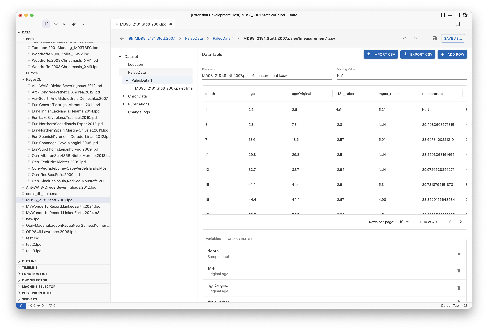

# LiPD VSCode Extension

This extension provides support for reading and writing LiPD (Linked Paleo Data) files in Visual Studio Code.

## Features

- Open and view LiPD (.lpd) files directly in VS Code
- Interactive editor with form-based editing of all LiPD properties
- Map visualization for location data using Mapbox
- Create new empty LiPD files
- Edit datasets with built-in undo/redo functionality
- Export CSV data from data tables
- **NEW!** LiPD Explorer view to browse remote datasets from a GraphDB SPARQL endpoint

## Screenshots

### Dataset Overview

### Interactive Map for Location Data

### Data Table Editing

### Publications

### LiPD Explorer

## Requirements

- Visual Studio Code 1.85.0 or higher
- Internet connection for accessing remote datasets

## Installation

You can install the extension directly from the VS Code Marketplace:

1. Open VS Code
2. Go to Extensions (Ctrl+Shift+X)
3. Search for "LiPD File Support"
4. Click Install

## Usage

### Opening LiPD Files:
- Double-click on any `.lpd` file in your workspace to open it in the custom editor
- You can also right-click on a `.lpd` file and select "Open With..." > "LiPD Editor"
- Browse and open remote datasets through the LiPD Explorer view in the activity bar

### Using the LiPD Explorer:
- Click on the LiPD logo in the activity bar to open the LiPD Explorer
- Browse available datasets from the configured GraphDB endpoint
- Click on any dataset to open it directly from the remote database
- Use the refresh button to update the dataset list
- Click on the status bar item to configure a different GraphDB endpoint

### Creating New Files:
- Create a new file with a `.lpd` extension
- An empty dataset will be created automatically

### Editing:
- Navigate through the dataset using the tree view
- Edit fields directly in the form
- Map locations can be set by dragging the marker or entering coordinates
- All changes support Undo (Ctrl+Z) and Redo (Ctrl+Y)

### Saving:
- Save changes with Ctrl+S (Cmd+S on macOS)
- Use File > Save As... to save to a new location

## Extension Settings

This extension contributes the following settings:

* `lipd.graphDbUrl`: URL of the GraphDB SPARQL endpoint for remote LiPD datasets

## Related projects
- [LiPD-JS](https://github.com/LinkedEarth/lipdjs) : This is a javascript library to read/write LiPD files. This extension uses this library.
- [PyLiPD](https://github.com/LinkedEarth/pylipd) : This is a python library to read/write LiPD files

## Known Issues

- Some complex LiPD structures may not be fully supported yet
- Currently, the extension works best with relatively small to medium-sized LiPD files

## Contributing

Contributions are welcome! Please feel free to submit a Pull Request to the [GitHub repository](https://github.com/LinkedEarth/lipd-vscode).

## License

This extension is licensed under the MIT License - see the LICENSE file for details. 
